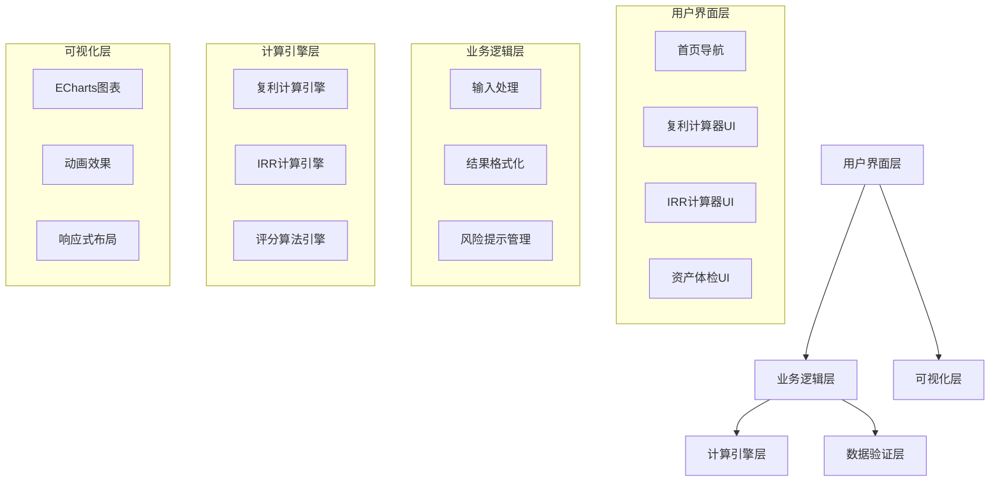

# 设计文档

## 概述

金融工具箱是一个纯前端的单页应用（SPA），使用现代Web技术栈构建。所有计算在客户端完成，确保用户数据隐私。系统采用模块化设计，每个工具作为独立组件，便于维护和扩展。

### 核心设计原则

1. **隐私优先** - 所有计算在本地完成，不向服务器发送用户数据
2. **视觉冲击** - 使用动画和图表增强说服力
3. **专业可信** - 采用金融行业标准的UI设计和配色
4. **移动优先** - 响应式设计，支持各种设备，针对平板和手机优化
5. **合规安全** - 明确的风险提示和免责声明

### 移动优先UI设计

**目标用户场景**: 银行从业人员使用平板电脑或手机向客户展示

**设计要点**:
- **大触控区域** - 所有按钮和输入框至少44x44px
- **清晰的视觉层次** - 重要信息突出显示
- **横屏/竖屏自适应** - 平板横屏、手机竖屏都能良好显示
- **简洁的导航** - 减少层级，快速切换工具

**响应式断点**:
```css
/* 手机竖屏 */
@media (max-width: 640px) { }

/* 手机横屏/小平板 */
@media (min-width: 641px) and (max-width: 1024px) { }

/* 大平板/桌面 */
@media (min-width: 1025px) { }
```

**配色方案**（金融专业风格）:
```javascript
const colors = {
  primary: '#1890ff',      // 蓝色 - 专业可信
  success: '#52c41a',      // 绿色 - 收益增长
  warning: '#faad14',      // 橙色 - 风险提示
  danger: '#f5222d',       // 红色 - 高风险
  background: '#f0f2f5',   // 浅灰 - 背景
  card: '#ffffff',         // 白色 - 卡片
  text: '#262626',         // 深灰 - 主文本
  textSecondary: '#8c8c8c' // 中灰 - 次要文本
};
```

## 架构

### 技术栈选择

- **前端框架**: React 18+ (组件化、状态管理、生态丰富)
- **UI组件库**: Ant Design (专业、中文友好、组件丰富)
- **图表库**: ECharts (强大的可视化能力、动画效果好)
- **样式方案**: CSS Modules + Tailwind CSS (模块化 + 实用类)
- **构建工具**: Vite (快速开发、热更新)
- **数学计算**: decimal.js (精确的十进制运算)

### 系统架构图



### 目录结构

```
financial-toolbox/
├── public/
│   └── index.html
├── src/
│   ├── components/          # 通用组件
│   │   ├── Layout/         # 布局组件
│   │   ├── RiskDisclaimer/ # 风险提示组件
│   │   └── NumberInput/    # 数字输入组件
│   ├── pages/              # 页面组件
│   │   ├── Home/           # 首页
│   │   ├── CompoundCalculator/  # 复利计算器
│   │   ├── IRRCalculator/       # IRR计算器
│   │   └── AssetAssessment/     # 资产体检
│   ├── utils/              # 工具函数
│   │   ├── calculations.js      # 计算函数
│   │   ├── validators.js        # 验证函数
│   │   └── formatters.js        # 格式化函数
│   ├── constants/          # 常量定义
│   │   └── config.js
│   ├── App.jsx
│   └── main.jsx
├── package.json
└── vite.config.js
```

## 组件与接口

### 1. 复利计算器组件

#### 输入接口

```typescript
interface CompoundCalculatorInput {
  principal: number;           // 本金 (1,000 - 100,000,000)
  simpleRate: number;          // 单利利率 (0.001 - 0.20)
  compoundRate: number;        // 复利利率 (0.001 - 0.20)
  years: number;               // 投资年限 (1 - 50)
}
```

#### 输出接口

```typescript
interface CompoundCalculatorOutput {
  simpleInterestData: Array<{year: number, amount: number}>;
  compoundInterestData: Array<{year: number, amount: number}>;
  finalSimpleAmount: number;
  finalCompoundAmount: number;
  difference: number;
  comparisonText: string;      // 例如："相当于一辆30万的车"
}
```

#### 核心计算函数

```javascript
/**
 * 计算单利
 * @param {number} principal - 本金
 * @param {number} rate - 年利率
 * @param {number} years - 年数
 * @returns {number} 最终金额
 */
function calculateSimpleInterest(principal, rate, years) {
  return principal * (1 + rate * years);
}

/**
 * 计算复利
 * @param {number} principal - 本金
 * @param {number} rate - 年利率
 * @param {number} years - 年数
 * @returns {number} 最终金额
 */
function calculateCompoundInterest(principal, rate, years) {
  return principal * Math.pow(1 + rate, years);
}

/**
 * 生成对比文本
 * @param {number} difference - 差额
 * @returns {string} 对比文本
 */
function generateComparisonText(difference) {
  if (difference >= 300000) return `相当于一辆${Math.floor(difference/10000)}万的车`;
  if (difference >= 100000) return `相当于${Math.floor(difference/10000)}万元`;
  if (difference >= 10000) return `相当于${(difference/10000).toFixed(1)}万元`;
  return `相当于${difference.toFixed(0)}元`;
}
```

### 2. IRR计算器组件

#### 输入接口

```typescript
interface CashFlowItem {
  year: number;                // 年份 (0-based)
  amount: number;              // 金额（负数=投入，正数=回报）
}

interface IRRCalculatorInput {
  cashFlows: CashFlowItem[];   // 现金流数组
}
```

#### 输出接口

```typescript
interface IRRCalculatorOutput {
  irr: number | null;          // IRR值（小数形式，如0.08表示8%）
  irrPercentage: string;       // IRR百分比字符串（如"8.00%"）
  interpretation: string;      // 结果解读
  isValid: boolean;            // 是否有有效解
  errorMessage?: string;       // 错误消息（如果有）
}
```

#### 核心计算函数

```javascript
/**
 * 使用牛顿-拉弗森法计算IRR
 * @param {CashFlowItem[]} cashFlows - 现金流数组
 * @param {number} guess - 初始猜测值
 * @param {number} maxIterations - 最大迭代次数
 * @param {number} tolerance - 容差
 * @returns {number | null} IRR值或null
 */
function calculateIRR(cashFlows, guess = 0.1, maxIterations = 100, tolerance = 0.00001) {
  let rate = guess;
  
  for (let i = 0; i < maxIterations; i++) {
    let npv = 0;
    let dnpv = 0;
    
    // 计算NPV和其导数
    for (let j = 0; j < cashFlows.length; j++) {
      const { year, amount } = cashFlows[j];
      npv += amount / Math.pow(1 + rate, year);
      dnpv -= year * amount / Math.pow(1 + rate, year + 1);
    }
    
    // 检查收敛
    if (Math.abs(npv) < tolerance) {
      return rate;
    }
    
    // 牛顿迭代
    if (dnpv === 0) return null;
    rate = rate - npv / dnpv;
  }
  
  return null; // 未收敛
}

/**
 * 生成IRR解读文本
 * @param {number} irr - IRR值
 * @returns {string} 解读文本
 */
function interpretIRR(irr) {
  const percentage = (irr * 100).toFixed(2);
  if (irr > 0.05) {
    return `年化收益率为${percentage}%，优于银行定存（约2-3%）`;
  } else if (irr > 0.02) {
    return `年化收益率为${percentage}%，与银行定存相当`;
  } else if (irr > 0) {
    return `年化收益率为${percentage}%，低于银行定存`;
  } else {
    return `年化收益率为${percentage}%，投资亏损`;
  }
}
```

### 3. 资产体检组件

#### 问卷数据结构

```typescript
interface Question {
  id: string;
  category: string;            // 分类：房产、负债、家庭、保障、储蓄、收入
  text: string;                // 问题文本
  options: QuestionOption[];   // 选项
  weight: number;              // 权重（影响评分）
}

interface QuestionOption {
  value: string;
  label: string;
  score: number;               // 该选项对应的风险分数
}

interface AssessmentInput {
  answers: Record<string, string>;  // questionId -> selectedValue
}
```

#### 输出接口

```typescript
interface AssessmentOutput {
  totalScore: number;          // 总分 (0-100)
  riskLevel: 'low' | 'medium' | 'high';  // 风险等级
  categoryScores: {            // 各类别得分
    housing: number;
    debt: number;
    family: number;
    insurance: number;
    savings: number;
    income: number;
  };
  suggestions: string[];       // 配置建议列表
}
```

#### 问卷配置

```javascript
const ASSESSMENT_QUESTIONS = [
  {
    id: 'housing',
    category: '房产',
    text: '您的房产状况？',
    options: [
      { value: 'own_no_loan', label: '有房无贷', score: 10 },
      { value: 'own_with_loan', label: '有房有贷', score: 30 },
      { value: 'renting', label: '租房', score: 50 }
    ],
    weight: 1.5
  },
  {
    id: 'loan',
    category: '负债',
    text: '除房贷外，是否有其他贷款？',
    options: [
      { value: 'no_loan', label: '无贷款', score: 0 },
      { value: 'small_loan', label: '少量贷款（<年收入30%）', score: 20 },
      { value: 'heavy_loan', label: '较多贷款（≥年收入30%）', score: 40 }
    ],
    weight: 1.2
  },
  {
    id: 'elderly',
    category: '家庭',
    text: '是否需要赡养老人？',
    options: [
      { value: 'no', label: '否', score: 0 },
      { value: 'one_side', label: '是，一方父母', score: 15 },
      { value: 'both_sides', label: '是，双方父母', score: 30 }
    ],
    weight: 1.0
  },
  {
    id: 'children',
    category: '家庭',
    text: '子女抚养情况？',
    options: [
      { value: 'no_children', label: '无子女', score: 0 },
      { value: 'one_child', label: '1个子女', score: 15 },
      { value: 'multiple_children', label: '2个及以上子女', score: 30 }
    ],
    weight: 1.0
  },
  {
    id: 'insurance',
    category: '保障',
    text: '家庭保险配置情况？',
    options: [
      { value: 'comprehensive', label: '配置齐全（重疾+医疗+意外+寿险）', score: 0 },
      { value: 'partial', label: '部分配置', score: 25 },
      { value: 'minimal', label: '仅社保或无保险', score: 50 }
    ],
    weight: 1.8
  },
  {
    id: 'emergency_fund',
    category: '储蓄',
    text: '应急资金储备情况？',
    options: [
      { value: 'sufficient', label: '充足（≥6个月支出）', score: 0 },
      { value: 'moderate', label: '一般（3-6个月支出）', score: 20 },
      { value: 'insufficient', label: '不足（<3个月支出）', score: 40 }
    ],
    weight: 1.3
  },
  {
    id: 'income_stability',
    category: '收入',
    text: '家庭收入稳定性？',
    options: [
      { value: 'stable', label: '稳定（双职工或稳定事业）', score: 0 },
      { value: 'moderate', label: '一般（单职工或收入波动）', score: 25 },
      { value: 'unstable', label: '不稳定（自由职业或创业）', score: 40 }
    ],
    weight: 1.4
  }
];
```

#### 评分算法

```javascript
/**
 * 计算风险评分
 * @param {Record<string, string>} answers - 用户答案
 * @returns {AssessmentOutput} 评估结果
 */
function calculateAssessment(answers) {
  let totalWeightedScore = 0;
  let totalWeight = 0;
  const categoryScores = {};
  
  // 计算加权总分
  ASSESSMENT_QUESTIONS.forEach(question => {
    const selectedValue = answers[question.id];
    const selectedOption = question.options.find(opt => opt.value === selectedValue);
    
    if (selectedOption) {
      totalWeightedScore += selectedOption.score * question.weight;
      totalWeight += question.weight;
      
      // 记录分类得分
      if (!categoryScores[question.category]) {
        categoryScores[question.category] = 0;
      }
      categoryScores[question.category] += selectedOption.score;
    }
  });
  
  // 归一化到0-100
  const totalScore = Math.round((totalWeightedScore / totalWeight));
  
  // 确定风险等级
  let riskLevel;
  if (totalScore < 30) riskLevel = 'low';
  else if (totalScore < 60) riskLevel = 'medium';
  else riskLevel = 'high';
  
  // 生成建议
  const suggestions = generateSuggestions(answers, categoryScores, riskLevel);
  
  return {
    totalScore,
    riskLevel,
    categoryScores,
    suggestions
  };
}

/**
 * 生成配置建议
 * @param {Record<string, string>} answers - 用户答案
 * @param {Object} categoryScores - 分类得分
 * @param {string} riskLevel - 风险等级
 * @returns {string[]} 建议列表
 */
function generateSuggestions(answers, categoryScores, riskLevel) {
  const suggestions = [];
  
  // 基于风险等级的总体建议
  if (riskLevel === 'high') {
    suggestions.push('您的家庭财务风险较高，建议优先配置保障型产品');
  } else if (riskLevel === 'medium') {
    suggestions.push('您的家庭财务状况一般，建议平衡配置保障和理财产品');
  } else {
    suggestions.push('您的家庭财务状况良好，可适当配置增值型产品');
  }
  
  // 基于具体问题的建议
  if (answers.insurance === 'minimal' || answers.insurance === 'partial') {
    suggestions.push('建议补充商业保险：重疾险、医疗险、意外险、定期寿险');
  }
  
  if (answers.emergency_fund === 'insufficient') {
    suggestions.push('建议建立应急资金：至少储备3-6个月的家庭支出');
  }
  
  if (answers.loan === 'heavy_loan') {
    suggestions.push('建议优先偿还高息债务，降低财务杠杆');
  }
  
  if (answers.elderly === 'both_sides' || answers.children === 'multiple_children') {
    suggestions.push('家庭负担较重，建议配置教育金和养老金规划');
  }
  
  if (answers.income_stability === 'unstable') {
    suggestions.push('收入不稳定，建议增加流动性资产配置，保持财务灵活性');
  }
  
  return suggestions;
}
```

## 数据模型

### 本地存储数据结构

```typescript
// 用户偏好设置
interface UserPreferences {
  hasSeenRiskWarning: boolean;     // 是否已看过风险提示
  defaultPrincipal: number;        // 默认本金
  defaultYears: number;            // 默认年限
}

// 计算历史记录（可选功能）
interface CalculationHistory {
  id: string;
  type: 'compound' | 'irr' | 'assessment';
  timestamp: number;
  input: any;
  output: any;
}
```

### 验证规则

```javascript
const VALIDATION_RULES = {
  principal: {
    min: 1000,
    max: 100000000,
    errorMessage: '本金必须在1,000到100,000,000元之间'
  },
  rate: {
    min: 0.001,
    max: 0.20,
    errorMessage: '利率必须在0.1%到20%之间'
  },
  years: {
    min: 1,
    max: 50,
    errorMessage: '投资年限必须在1到50年之间'
  },
  cashFlowAmount: {
    min: -100000000,
    max: 100000000,
    errorMessage: '现金流金额必须在-100,000,000到100,000,000之间'
  }
};
```

## 正确性属性

*属性是一个特征或行为，应该在系统的所有有效执行中保持为真——本质上是关于系统应该做什么的形式化陈述。属性是人类可读规范和机器可验证正确性保证之间的桥梁。*


### 属性 1: 复利计算器输入验证

*对于任意* 输入值，如果本金在1,000到100,000,000之间、利率在0.1%到20%之间、年限在1到50年之间，则应该被接受；否则应该被拒绝并显示错误消息。

**验证需求: 2.1, 2.2, 2.3, 2.7**

### 属性 2: 复利大于单利（相同利率）

*对于任意* 本金、利率和年限（年限>1），当单利利率等于复利利率时，复利的最终金额应该大于单利的最终金额。

**验证需求: 2.4, 2.5**

### 属性 3: 复利计算精度

*对于任意* 有效输入，复利计算结果应该精确到分（小数点后2位），不应该有浮点数误差。

**验证需求: 5.4**

### 属性 4: 图表数据完整性

*对于任意* 有效输入，生成的图表数据应该包含从第0年到第N年的所有数据点，且单利和复利数据点数量相同。

**验证需求: 2.4**

### 属性 5: 差额对比文本生成

*对于任意* 计算出的差额，应该生成非空的可读对比文本，且文本应该包含数字和单位。

**验证需求: 2.6**

### 属性 6: IRR计算正确性（NPV验证）

*对于任意* 有效现金流序列，如果IRR计算成功返回一个利率r，则使用该利率计算的净现值（NPV）应该接近零（误差<0.01）。

**验证需求: 3.3**

### 属性 7: IRR输入灵活性

*对于任意* 数量的现金流条目（至少2个），系统应该接受并尝试计算IRR，且应该支持正负值混合。

**验证需求: 3.1, 3.2**

### 属性 8: IRR结果格式化

*对于任意* 成功计算的IRR值，应该格式化为百分比字符串，保留2位小数，且应该生成相应的解读文本。

**验证需求: 3.4, 3.5**

### 属性 9: 资产评分范围约束

*对于任意* 完整的问卷答案，计算出的风险评分应该在0到100之间（包含边界）。

**验证需求: 4.3**

### 属性 10: 风险等级映射一致性

*对于任意* 风险评分，应该映射到唯一的风险等级（低/中/高），且映射规则应该一致：0-29为低风险，30-59为中风险，60-100为高风险。

**验证需求: 4.5**

### 属性 11: 评估建议非空性

*对于任意* 完整的问卷答案，生成的建议列表应该至少包含一条建议，且所有建议都应该是产品类型而非具体品牌名称。

**验证需求: 4.6, 4.7**

### 属性 12: 表单验证完整性

*对于任意* 未完成的问卷（存在未回答的必填问题），提交时应该被阻止，并显示提示消息。

**验证需求: 4.8**

### 属性 13: 数字格式化一致性

*对于任意* 大于999的数字，在界面显示时应该使用千位分隔符格式化（例如：1,000,000）。

**验证需求: 6.5**

### 属性 14: 页面风险提示一致性

*对于任意* 计算工具页面，页面底部应该显示免责声明，且计算结果区域应该显示风险提示文字。

**验证需求: 7.2, 7.5**

### 属性 15: 客户端计算隔离

*对于任意* 用户操作，系统不应该向外部服务器发送包含用户输入数据的网络请求（静态资源请求除外）。

**验证需求: 5.2**

### 属性 16: 导航功能一致性

*对于任意* 工具卡片，点击后应该导航到对应的工具页面，且所有页面都应该包含一致的页头和页脚。

**验证需求: 1.2, 1.3**

### 属性 17: 输入字段标签完整性

*对于任意* 输入字段，应该有对应的中文标签或说明文字。

**验证需求: 6.2, 6.4**

## 错误处理

### 输入验证错误

```javascript
class ValidationError extends Error {
  constructor(field, message) {
    super(message);
    this.name = 'ValidationError';
    this.field = field;
  }
}

// 使用示例
function validatePrincipal(value) {
  if (value < 1000 || value > 100000000) {
    throw new ValidationError('principal', '本金必须在1,000到100,000,000元之间');
  }
}
```

### 计算错误

```javascript
class CalculationError extends Error {
  constructor(message, details) {
    super(message);
    this.name = 'CalculationError';
    this.details = details;
  }
}

// IRR无解情况
function handleIRRNoSolution(cashFlows) {
  throw new CalculationError(
    '无法计算IRR，请检查现金流数据',
    { reason: 'no_convergence', cashFlows }
  );
}
```

### 错误处理策略

1. **输入验证错误** - 在用户输入时实时验证，显示内联错误提示
2. **计算错误** - 捕获并显示友好的错误消息，提供解决建议
3. **网络错误** - 由于是纯前端应用，不应该有网络错误（除静态资源）
4. **边缘情况** - 对于特殊输入（如全零现金流），返回明确的错误消息

### 错误消息设计原则

- 使用中文
- 明确指出问题所在
- 提供解决方案或有效范围
- 避免技术术语
- 保持友好和专业的语气

## 测试策略

### 双重测试方法

本项目采用**单元测试**和**基于属性的测试**相结合的方法：

- **单元测试**：验证特定示例、边缘情况和错误条件
- **属性测试**：验证所有输入的通用属性
- 两者互补，共同确保全面覆盖

### 单元测试重点

单元测试应该专注于：
- 特定示例（如：本金100万，利率3%，10年的计算结果）
- 边缘情况（如：最小本金、最大年限、零现金流）
- 错误条件（如：无效输入、IRR无解）
- 组件集成点（如：图表数据生成、UI交互）

避免编写过多单元测试 - 属性测试已经覆盖了大量输入组合。

### 基于属性的测试

**测试库选择**: fast-check (JavaScript/TypeScript的属性测试库)

**配置要求**:
- 每个属性测试至少运行100次迭代
- 每个测试必须引用设计文档中的属性
- 标签格式: `// Feature: financial-toolbox, Property N: [属性文本]`

**属性测试示例**:

```javascript
import fc from 'fast-check';

// Feature: financial-toolbox, Property 2: 复利大于单利（相同利率）
test('复利应该大于单利（相同利率，年限>1）', () => {
  fc.assert(
    fc.property(
      fc.integer({ min: 1000, max: 100000000 }),  // 本金
      fc.float({ min: 0.001, max: 0.20 }),        // 利率
      fc.integer({ min: 2, max: 50 }),            // 年限
      (principal, rate, years) => {
        const simpleAmount = calculateSimpleInterest(principal, rate, years);
        const compoundAmount = calculateCompoundInterest(principal, rate, years);
        return compoundAmount > simpleAmount;
      }
    ),
    { numRuns: 100 }
  );
});

// Feature: financial-toolbox, Property 6: IRR计算正确性（NPV验证）
test('IRR计算应该使NPV接近零', () => {
  fc.assert(
    fc.property(
      fc.array(
        fc.record({
          year: fc.integer({ min: 0, max: 30 }),
          amount: fc.float({ min: -1000000, max: 1000000 })
        }),
        { minLength: 2, maxLength: 20 }
      ),
      (cashFlows) => {
        const result = calculateIRR(cashFlows);
        if (result.isValid) {
          const npv = calculateNPV(cashFlows, result.irr);
          return Math.abs(npv) < 0.01;
        }
        return true; // 无解的情况也是有效的
      }
    ),
    { numRuns: 100 }
  );
});

// Feature: financial-toolbox, Property 9: 资产评分范围约束
test('风险评分应该在0-100之间', () => {
  fc.assert(
    fc.property(
      generateRandomAnswers(),  // 自定义生成器
      (answers) => {
        const result = calculateAssessment(answers);
        return result.totalScore >= 0 && result.totalScore <= 100;
      }
    ),
    { numRuns: 100 }
  );
});
```

### 测试数据生成器

为属性测试创建智能生成器：

```javascript
// 生成有效的现金流序列
function generateValidCashFlows() {
  return fc.array(
    fc.record({
      year: fc.integer({ min: 0, max: 30 }),
      amount: fc.float({ min: -1000000, max: 1000000 })
    }),
    { minLength: 2, maxLength: 20 }
  ).filter(flows => {
    // 确保至少有一个负值和一个正值
    const hasNegative = flows.some(f => f.amount < 0);
    const hasPositive = flows.some(f => f.amount > 0);
    return hasNegative && hasPositive;
  });
}

// 生成完整的问卷答案
function generateRandomAnswers() {
  return fc.record({
    housing: fc.constantFrom('own_no_loan', 'own_with_loan', 'renting'),
    loan: fc.constantFrom('no_loan', 'small_loan', 'heavy_loan'),
    elderly: fc.constantFrom('no', 'one_side', 'both_sides'),
    children: fc.constantFrom('no_children', 'one_child', 'multiple_children'),
    insurance: fc.constantFrom('comprehensive', 'partial', 'minimal'),
    emergency_fund: fc.constantFrom('sufficient', 'moderate', 'insufficient'),
    income_stability: fc.constantFrom('stable', 'moderate', 'unstable')
  });
}
```

### 测试覆盖目标

- **核心计算函数**: 100%代码覆盖
- **UI组件**: 主要交互路径覆盖
- **验证逻辑**: 100%分支覆盖
- **错误处理**: 所有错误类型覆盖

### 测试执行

```bash
# 运行所有测试
npm test

# 运行属性测试（更多迭代）
npm test -- --testNamePattern="Property"

# 生成覆盖率报告
npm test -- --coverage
```

## 性能考虑

### 计算性能

- **复利计算**: O(n) 时间复杂度，n为年数，最大50年，性能无问题
- **IRR计算**: O(m × k) 时间复杂度，m为现金流数量，k为迭代次数（通常<20），性能可接受
- **评分计算**: O(q) 时间复杂度，q为问题数量（固定7个），性能优秀

### 渲染性能

- 使用React.memo优化组件重渲染
- 图表使用ECharts的懒加载和按需渲染
- 大数字格式化使用缓存避免重复计算

### 内存管理

- 不保存历史记录（可选功能）
- 及时清理图表实例
- 避免内存泄漏（正确使用useEffect清理函数）

## 可访问性

- 所有输入字段有明确的label
- 使用语义化HTML标签
- 支持键盘导航
- 颜色对比度符合WCAG 2.1 AA标准
- 错误消息与输入字段关联

## 浏览器兼容性

- 支持Chrome 90+
- 支持Firefox 88+
- 支持Safari 14+
- 支持Edge 90+
- 移动端支持iOS Safari 14+, Chrome Android 90+

## 部署方案

### 静态网站托管

推荐使用以下平台之一：
- **Vercel**: 自动部署、CDN加速、免费HTTPS
- **Netlify**: 类似Vercel，易于配置
- **GitHub Pages**: 免费、简单、适合开源项目
- **阿里云OSS + CDN**: 国内访问速度快

### 构建配置

```javascript
// vite.config.js
export default {
  build: {
    outDir: 'dist',
    minify: 'terser',
    sourcemap: false,
    rollupOptions: {
      output: {
        manualChunks: {
          'vendor': ['react', 'react-dom'],
          'charts': ['echarts'],
          'ui': ['antd']
        }
      }
    }
  }
}
```

### 性能优化

- 代码分割（按路由）
- 图片懒加载
- 资源压缩（gzip/brotli）
- CDN加速
- 浏览器缓存策略

## 未来扩展

### 第二期功能

1. **保险需求计算器** - 根据家庭情况计算保额需求
2. **退休规划计算器** - 计算退休所需储蓄
3. **教育金规划工具** - 计算子女教育资金需求
4. **房贷计算器** - 等额本息/等额本金对比

### 技术改进

1. **PWA支持** - 离线使用、添加到主屏幕
2. **数据导出** - 导出PDF报告
3. **分享功能** - 生成分享链接或图片
4. **多语言支持** - 英文、繁体中文

### 数据分析（可选）

如果需要了解用户使用情况（需征得用户同意）：
- 使用匿名化的前端埋点
- 只收集功能使用统计，不收集输入数据
- 明确告知用户并提供退出选项
