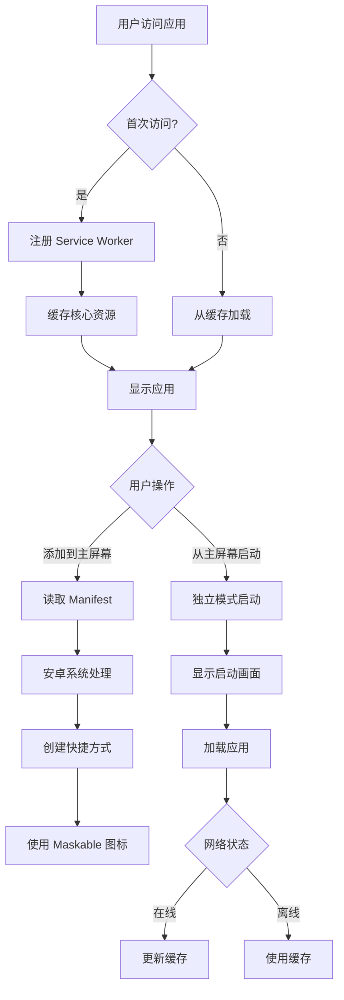

# 设计文档

## 概述

本设计文档描述了如何优化金融工具箱 PWA 在安卓系统上的表现。当前应用在 iOS 上运行良好，但在安卓设备上添加到主屏幕后无法正确以独立模式运行。本设计将通过优化 manifest 配置、添加必要的 meta 标签、改进图标适配以及增强 Service Worker 配置来解决这些问题。

核心目标是确保安卓用户获得与 iOS 用户一致的 PWA 体验，包括独立模式运行、正确的图标显示、启动画面支持和可靠的离线功能。

## 架构

### 整体架构

PWA 优化涉及以下几个层面的改进：

1. **Manifest 层**: 优化 Web App Manifest 配置，确保安卓系统正确识别应用属性
2. **HTML Meta 层**: 添加必要的 meta 标签，提供额外的浏览器兼容性支持
3. **图标资源层**: 提供符合安卓自适应图标规范的 maskable 图标
4. **Service Worker 层**: 确保离线缓存策略在安卓设备上正常工作
5. **构建配置层**: 优化 Vite PWA 插件配置，生成符合标准的 PWA 资源

### 技术栈

- **vite-plugin-pwa**: Vite 的 PWA 插件，用于生成 manifest 和 Service Worker
- **Workbox**: Google 的 Service Worker 库，提供缓存策略
- **Web App Manifest**: W3C 标准的应用清单格式
- **Maskable Icons**: 适配安卓自适应图标的图标格式

### 架构图



## 组件和接口

### 1. Manifest 配置组件

**职责**: 定义 PWA 的元数据和行为特性

**配置项**:

```typescript
interface ManifestConfig {
  name: string;              // 完整应用名称
  short_name: string;        // 短名称（主屏幕显示）
  description: string;       // 应用描述
  theme_color: string;       // 主题色（状态栏颜色）
  background_color: string;  // 背景色（启动画面）
  display: 'standalone';     // 显示模式
  orientation: string;       // 屏幕方向
  start_url: string;         // 启动 URL
  scope: string;             // 应用作用域
  lang: string;              // 语言
  dir: 'ltr' | 'rtl';       // 文本方向
  categories: string[];      // 应用分类
  icons: IconConfig[];       // 图标配置
}
```

**关键改进**:
- 添加 `orientation: 'portrait-primary'` - 优先使用竖屏模式
- 添加 `categories: ['finance', 'utilities']` - 帮助应用分类
- 添加 `lang: 'zh-CN'` - 指定中文语言
- 添加 `dir: 'ltr'` - 指定从左到右的文本方向
- 修改 `start_url: '/?source=pwa'` - 添加来源追踪参数

### 2. 图标配置组件

**职责**: 提供多种尺寸和用途的应用图标

**图标规格**:

```typescript
interface IconConfig {
  src: string;               // 图标路径
  sizes: string;             // 图标尺寸
  type: string;              // MIME 类型
  purpose: 'any' | 'maskable' | 'monochrome';  // 图标用途
}
```

**必需图标**:
- 192x192 (any) - 标准图标，用于应用列表
- 512x512 (any) - 高分辨率图标，用于启动画面
- 192x192 (maskable) - 自适应图标（小尺寸）
- 512x512 (maskable) - 自适应图标（大尺寸）

**Maskable 图标设计要求**:
- 安全区域: 图标中心 80% 的区域（40% 半径圆形）
- 最小安全区域: 图标中心 66.67% 的区域（33.33% 半径圆形）
- 重要内容必须在安全区域内，避免被裁切
- 背景应延伸到整个图标区域

### 3. HTML Meta 标签组件

**职责**: 提供浏览器兼容性和 PWA 功能支持

**必需标签**:

```html
<!-- PWA 基础配置 -->
<meta name="theme-color" content="#1890ff">
<meta name="mobile-web-app-capable" content="yes">
<meta name="apple-mobile-web-app-capable" content="yes">
<meta name="apple-mobile-web-app-status-bar-style" content="default">
<meta name="apple-mobile-web-app-title" content="金融工具箱">

<!-- Manifest 链接 -->
<link rel="manifest" href="/manifest.webmanifest">

<!-- 视口配置 -->
<meta name="viewport" content="width=device-width, initial-scale=1.0, viewport-fit=cover">
```

**标签说明**:
- `theme-color`: 定义浏览器工具栏和状态栏颜色
- `mobile-web-app-capable`: 启用 PWA 全屏模式
- `apple-mobile-web-app-capable`: iOS Safari 兼容性
- `apple-mobile-web-app-status-bar-style`: iOS 状态栏样式
- `viewport-fit=cover`: 支持刘海屏等异形屏幕

### 4. Service Worker 配置组件

**职责**: 管理资源缓存和离线功能

**缓存策略**:

```typescript
interface CacheStrategy {
  // 预缓存策略 - 构建时确定的静态资源
  precache: {
    patterns: string[];      // 文件匹配模式
    maxSize: number;         // 最大文件大小
  };
  
  // 运行时缓存策略 - 动态请求的资源
  runtimeCache: {
    urlPattern: RegExp;      // URL 匹配模式
    handler: CacheHandler;   // 缓存处理器
    options: CacheOptions;   // 缓存选项
  }[];
}

type CacheHandler = 
  | 'CacheFirst'    // 缓存优先
  | 'NetworkFirst'  // 网络优先
  | 'StaleWhileRevalidate';  // 缓存同时更新

interface CacheOptions {
  cacheName: string;         // 缓存名称
  expiration?: {
    maxEntries: number;      // 最大缓存条目
    maxAgeSeconds: number;   // 最大缓存时间
  };
  cacheableResponse?: {
    statuses: number[];      // 可缓存的响应状态码
  };
}
```

**当前配置分析**:
- ✅ 已配置预缓存模式匹配: `**/*.{js,css,html,ico,png,svg,woff,woff2}`
- ✅ 已设置合理的文件大小限制: 5MB
- ✅ 已配置 Google Fonts 的运行时缓存
- ⚠️ 需要验证在安卓设备上的实际表现

### 5. Vite PWA 插件配置组件

**职责**: 集成和配置 PWA 功能到构建流程

**配置结构**:

```typescript
interface VitePWAConfig {
  registerType: 'autoUpdate' | 'prompt';  // 更新策略
  includeAssets: string[];                // 额外包含的资源
  manifest: ManifestConfig;               // Manifest 配置
  workbox: WorkboxConfig;                 // Workbox 配置
  devOptions?: {
    enabled: boolean;                     // 开发模式启用
    type: 'module';                       // Service Worker 类型
  };
}
```

## 数据模型

### PWA 安装状态模型

```typescript
interface PWAInstallState {
  // 安装状态
  isInstallable: boolean;        // 是否可安装
  isInstalled: boolean;          // 是否已安装
  installPromptEvent: Event | null;  // 安装提示事件
  
  // 平台信息
  platform: 'android' | 'ios' | 'desktop' | 'unknown';
  browser: string;               // 浏览器类型
  
  // Service Worker 状态
  serviceWorkerRegistered: boolean;
  serviceWorkerActive: boolean;
  
  // 网络状态
  isOnline: boolean;
  
  // 用户交互
  installPromptShown: boolean;
  installPromptDismissed: boolean;
  installDate: Date | null;
}
```

### 图标资源模型

```typescript
interface IconResource {
  src: string;                   // 图标文件路径
  sizes: string;                 // 尺寸（如 "192x192"）
  type: string;                  // MIME 类型
  purpose: IconPurpose;          // 图标用途
  
  // 设计规格（用于生成）
  safeZoneRadius?: number;       // 安全区域半径百分比
  backgroundColor?: string;      // 背景色
}

type IconPurpose = 'any' | 'maskable' | 'monochrome';
```

### 缓存资源模型

```typescript
interface CachedResource {
  url: string;                   // 资源 URL
  cacheName: string;             // 缓存名称
  cachedAt: Date;                // 缓存时间
  expiresAt: Date;               // 过期时间
  size: number;                  // 资源大小
  type: string;                  // 资源类型
}
```


## 正确性属性

*属性是一个特征或行为，应该在系统的所有有效执行中保持为真——本质上是关于系统应该做什么的形式化陈述。属性作为人类可读规范和机器可验证正确性保证之间的桥梁。*

### 属性 1: 独立模式运行验证

*对于任何*已安装的 PWA 应用，当从主屏幕启动时，应用应当在独立模式下运行（`window.matchMedia('(display-mode: standalone)').matches` 返回 true），不显示浏览器 UI。

**验证需求: 1.1, 1.3**

### 属性 2: Manifest 必需字段完整性

*对于任何*生成的 manifest.json 文件，应当包含所有必需的 PWA 字段：`name`、`short_name`、`description`、`theme_color`、`background_color`、`display`、`start_url`、`scope`、`orientation`、`lang`、`dir`、`categories` 和 `icons`。

**验证需求: 2.1, 2.2, 2.3, 2.4**

### 属性 3: Start URL 追踪参数

*对于任何*生成的 manifest 配置，`start_url` 字段应当包含查询参数（如 `?source=pwa`），以便追踪 PWA 安装来源。

**验证需求: 2.5**

### 属性 4: 图标配置完整性

*对于任何*生成的 manifest 配置，`icons` 数组应当同时包含：
- 至少一个 192x192 尺寸的图标
- 至少一个 512x512 尺寸的图标
- 至少一个 `purpose: 'any'` 的图标
- 至少一个 `purpose: 'maskable'` 的图标

**验证需求: 3.1, 3.2, 3.5**

### 属性 5: Theme Color 一致性

*对于任何*构建输出，HTML 中的 `theme-color` meta 标签的值应当与 manifest.json 中的 `theme_color` 字段值完全一致。

**验证需求: 4.1**

### 属性 6: Service Worker 注册

*对于任何*首次访问应用的用户，如果浏览器支持 Service Worker，系统应当成功注册 Service Worker（`navigator.serviceWorker.ready` 状态为 resolved）。

**验证需求: 6.1**

### 属性 7: 核心资源缓存

*对于任何*成功注册的 Service Worker，应当缓存所有核心应用资源，包括：HTML 入口文件、CSS 样式文件、JavaScript 脚本文件和应用图标文件。

**验证需求: 6.2**

### 属性 8: 离线功能可用性

*对于任何*已缓存资源的应用，在离线状态下（`navigator.onLine === false`），应用应当能够从缓存加载并正常显示界面，核心计算功能应当可用。

**验证需求: 6.3, 6.4**

### 属性 9: Service Worker 自动更新

*对于任何*已安装的 Service Worker，当检测到新版本时（新的 Service Worker 文件），系统应当自动下载并激活新版本，更新缓存的资源。

**验证需求: 6.5**

### 属性 10: 安装提示触发

*对于任何*满足 PWA 安装条件的访问（manifest 有效、HTTPS、有 Service Worker），浏览器应当触发 `beforeinstallprompt` 事件，允许应用控制安装提示的显示时机。

**验证需求: 7.1**

### 属性 11: PWA 安装标准合规性

*对于任何*生成的 manifest 配置，应当满足 Chrome for Android 的 PWA 安装标准，包含所有必需字段：`name`（或 `short_name`）、至少一个 192x192 的图标、`start_url` 和 `display` 设置为 `standalone`、`fullscreen` 或 `minimal-ui`。

**验证需求: 7.2**

### 属性 12: 已安装应用不显示提示

*对于任何*在独立模式下运行的应用（已安装），安装提示 UI 应当不显示，`beforeinstallprompt` 事件应当不被触发。

**验证需求: 7.5**

### 属性 13: 优雅降级

*对于任何*不支持 Service Worker 的浏览器环境，应用应当仍能正常加载和显示，核心功能应当可用，只是缺少离线支持。

**验证需求: 8.5**

## 错误处理

### Service Worker 注册失败

**场景**: 浏览器不支持 Service Worker 或注册过程出错

**处理策略**:
```typescript
if ('serviceWorker' in navigator) {
  try {
    await navigator.serviceWorker.register('/sw.js');
    console.log('Service Worker 注册成功');
  } catch (error) {
    console.warn('Service Worker 注册失败，应用将在无离线支持模式下运行', error);
    // 应用继续正常运行，只是没有离线功能
  }
} else {
  console.warn('浏览器不支持 Service Worker');
  // 优雅降级，应用正常运行
}
```

### Manifest 加载失败

**场景**: manifest.json 文件无法加载或解析失败

**处理策略**:
- 确保 manifest.json 在构建时正确生成
- 使用 Vite PWA 插件的验证功能检查 manifest 格式
- 在开发环境中启用 PWA 开发模式，及时发现问题

### 图标资源缺失

**场景**: 配置的图标文件不存在或无法加载

**处理策略**:
- 在构建时验证所有图标文件存在
- 使用 `includeAssets` 配置确保图标被正确复制到输出目录
- 提供后备图标方案

### 缓存配额超限

**场景**: Service Worker 缓存的资源超过浏览器配额

**处理策略**:
```typescript
// 在 Workbox 配置中设置缓存限制
{
  expiration: {
    maxEntries: 50,        // 最多缓存 50 个条目
    maxAgeSeconds: 30 * 24 * 60 * 60,  // 30 天过期
  }
}
```

### 离线状态下的网络请求

**场景**: 用户在离线状态下尝试访问未缓存的资源

**处理策略**:
- 使用 Workbox 的 `NetworkFirst` 策略，优先尝试网络请求
- 网络失败时回退到缓存
- 对于完全离线的情况，显示友好的错误提示

### 安装提示被阻止

**场景**: 浏览器阻止了 PWA 安装提示

**处理策略**:
```typescript
let deferredPrompt: any = null;

window.addEventListener('beforeinstallprompt', (e) => {
  // 阻止默认的安装提示
  e.preventDefault();
  // 保存事件，稍后使用
  deferredPrompt = e;
});

// 在合适的时机显示自定义安装提示
async function showInstallPrompt() {
  if (!deferredPrompt) {
    console.log('安装提示不可用');
    return;
  }
  
  try {
    deferredPrompt.prompt();
    const { outcome } = await deferredPrompt.userChoice;
    console.log(`用户选择: ${outcome}`);
    deferredPrompt = null;
  } catch (error) {
    console.error('显示安装提示失败', error);
  }
}
```

## 测试策略

### 双重测试方法

本项目采用单元测试和基于属性的测试相结合的方法，以确保全面覆盖：

- **单元测试**: 验证特定示例、边缘情况和错误条件
- **属性测试**: 通过随机化输入验证所有输入的通用属性
- 两者互补且都是必需的，以实现全面覆盖

### 单元测试策略

单元测试应专注于：

1. **配置验证示例**
   - 验证 manifest.json 包含特定的 meta 标签
   - 验证 HTML 包含必需的 PWA meta 标签
   - 验证图标文件存在于正确的路径

2. **边缘情况**
   - 浏览器不支持 Service Worker 的情况
   - manifest 文件格式错误的情况
   - 图标文件缺失的情况

3. **错误条件**
   - Service Worker 注册失败
   - 缓存配额超限
   - 网络请求失败

4. **集成点**
   - Vite 构建流程集成
   - PWA 插件配置正确性
   - 资源文件正确复制到输出目录

### 基于属性的测试策略

**测试库选择**: 使用 `fast-check` (JavaScript/TypeScript 的属性测试库)

**配置要求**:
- 每个属性测试至少运行 100 次迭代
- 每个测试必须引用其设计文档属性
- 标签格式: **Feature: pwa-android-optimization, Property {number}: {property_text}**

**属性测试重点**:

1. **Manifest 配置属性** (属性 2, 3, 4)
   - 生成随机的 manifest 配置
   - 验证所有必需字段存在
   - 验证字段值符合规范

2. **图标配置属性** (属性 4)
   - 生成随机的图标配置数组
   - 验证包含所需尺寸和用途的图标
   - 验证图标路径格式正确

3. **缓存策略属性** (属性 7, 8)
   - 生成随机的资源 URL 列表
   - 验证所有核心资源被缓存
   - 验证离线状态下可以访问缓存资源

4. **Service Worker 生命周期属性** (属性 6, 9)
   - 模拟不同的 Service Worker 状态
   - 验证注册、激活和更新流程
   - 验证状态转换的正确性

5. **安装提示属性** (属性 10, 12)
   - 模拟不同的安装状态
   - 验证提示显示逻辑
   - 验证已安装应用不显示提示

### 测试环境

**开发环境测试**:
```typescript
// vite.config.ts 中启用 PWA 开发模式
VitePWA({
  devOptions: {
    enabled: true,
    type: 'module',
  }
})
```

**真实设备测试**:
- Chrome for Android (最新版本)
- Samsung Internet (最新版本)
- Firefox for Android (最新版本)
- Edge for Android (最新版本)

**测试场景**:
1. 首次访问 → 验证 Service Worker 注册
2. 添加到主屏幕 → 验证独立模式启动
3. 离线使用 → 验证缓存功能
4. 应用更新 → 验证 Service Worker 更新
5. 不同浏览器 → 验证跨浏览器兼容性

### 自动化测试工具

**Lighthouse CI**: 用于验证 PWA 评分和最佳实践
```bash
# 运行 Lighthouse PWA 审计
lighthouse https://your-app.com --view --preset=pwa
```

**PWA Builder**: 验证 manifest 配置和 PWA 功能
- 访问 https://www.pwabuilder.com/
- 输入应用 URL
- 查看 PWA 功能报告

**Chrome DevTools**: 手动测试和调试
- Application 面板 → Manifest 检查
- Application 面板 → Service Workers 状态
- Application 面板 → Cache Storage 内容
- Network 面板 → 离线模式测试

### 持续集成测试

在 CI/CD 流程中集成以下测试：

1. **构建验证**
   - 验证 manifest.json 生成
   - 验证 Service Worker 生成
   - 验证图标文件复制

2. **Lighthouse CI**
   - PWA 评分 ≥ 90
   - 所有 PWA 审计项通过

3. **单元测试和属性测试**
   - 所有测试通过
   - 代码覆盖率 ≥ 80%

### 测试覆盖目标

- **配置文件**: 100% (manifest, meta 标签)
- **Service Worker 逻辑**: 90%
- **安装提示逻辑**: 85%
- **缓存策略**: 90%
- **整体代码**: 80%
